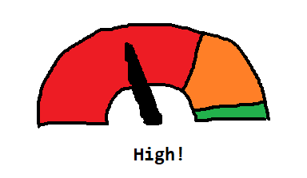

## Major TODOs: 
- [ ] An intuitive indicator for describing the risk of getting infected in a location. 
  - [ ] SUGGESTION: A semi-circle gauge chart
  
      
  - [ ] Research for available methodologies that can be used for available data!
- [ ] Highlight selected area in the map! 

## Minor TODOs:
- [ ] Splash screen 
- [ ] REVIEW: Create non-transparent backdrop for drawer. 
- [ ] Ensure API requests updates the UI in proper order
- [ ] API requests throttling   
